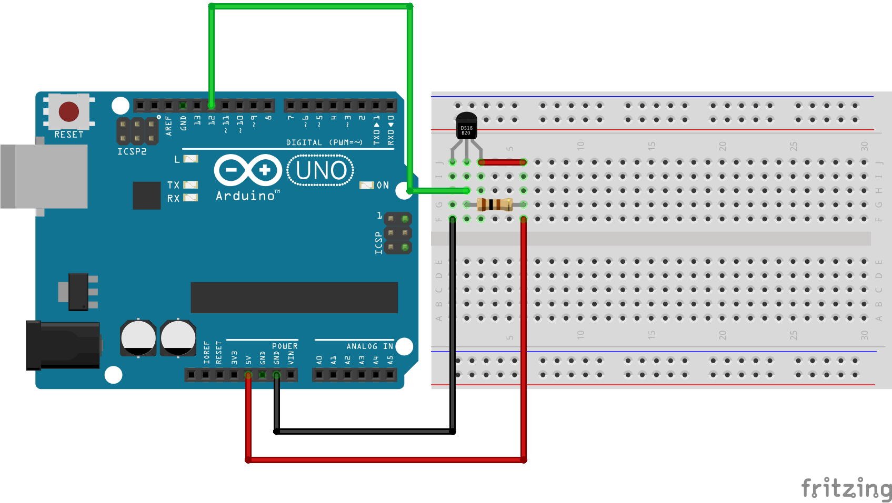

## Read the 1-wire DS18B20 temperature sensor
Part of the Bas on Tech Arduino YouTube lessons - More info at https://arduino-lessons.com

Subscribe to the Bas on Tech YouTube channel via http://www.youtube.com/c/BasOnTech?sub_confirmation=1

## Circuit
