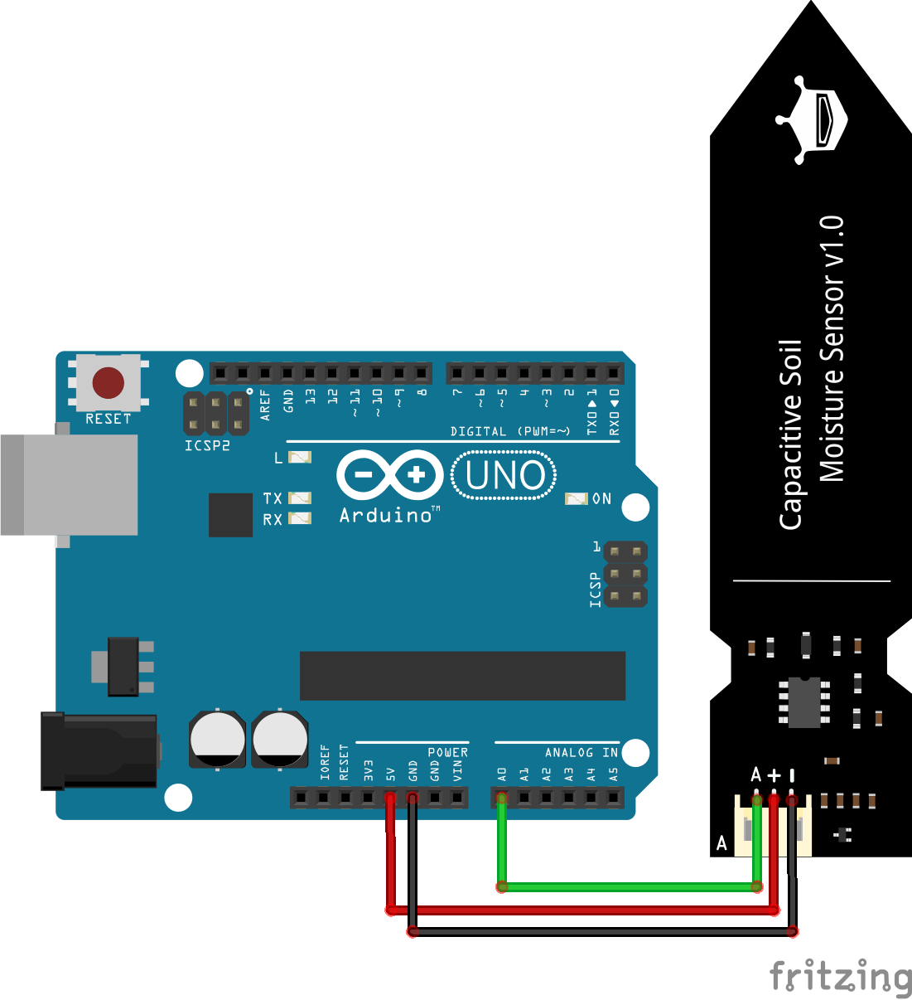

# Arduino capacitive soil moist sensor
Part of the Bas on Tech Arduino YouTube tutorials - More info at https://arduino-tutorials.net

Subscribe to the Bas on Tech YouTube channel via http://www.youtube.com/c/BasOnTech?sub_confirmation=1

## The circuit
